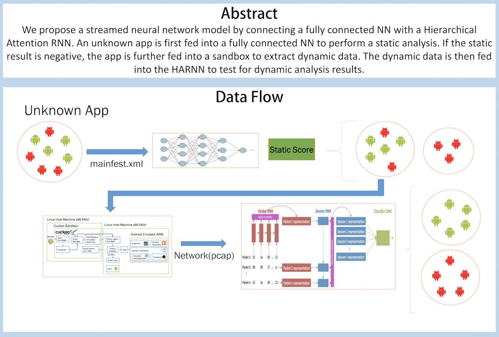

# Android-Malware-Dection-with-Mixed-NN
Using Static analysis with fully connected DNN and Dynamic analysis with HARNN
This is a final project in our 2018 Fall semester 網路多媒體實驗 course in NTUEE 

## Getting Started
To clone our project and install python dependencies:
```
git clone https://github.com/reggiehsu111/Android-Malware-Dection-with-Streamed-NN.git
```
Using Python3:
```
pip install -r requirements.txt
```
For default data used in this project, please refer to:

https://iscxdownloads.cs.unb.ca/iscxdownloads/CICAndMal2017/APKs/?fbclid=IwAR281sfNzoTGs1Ycdxv2JLiSZuCgzdGRvWqibrKYazEuuCqNp-aCbp2PucA
### Poster

### Installing Cuckoo Sandbox Evironment
For dynamic analysis with cuckoo droid, please refer to the cuckoo official documentation.
https://cuckoo-droid.readthedocs.io/en/latest/
#### For setting up environment manually on an Ubuntu 16.04 host, follow steps in /cuckoo_installation/process.md:

https://github.com/reggiehsu111/Android-Malware-Detection-with-Streamed-NN/blob/master/cuckoo_installation/process.md

### Demo video (in Mandarin)
https://www.youtube.com/watch?v=TS-75R1Va10&t=82s

## Running the Tests
The test involves  steps, you can either run each step separately or stream the analysis steps with our script:
- Static preprocessing
- Static training
- Static analysis
- Dynamic preprocessing
- Dynamic training
- Dynamic analysis
The shell script for streaming the analysis phase is written in malware_distinguisher.sh
```
bash malware_distinguisher.sh
```
The script iteratively asks for the cuckoo analysis folder with a ```APK File Directory?``` , you should type in the path after the notion.
```
$apk_dir_path
```

### Static preprocessing
The static model uses keras with tensorflow backend, make sure to install.
Default directory lay out, all apps in directories end with ```.apk```:
```
.
    ├── static_preprocessing.py      # Python file to preprocess data
    ├── malware                      # Directory to store malwares
    │   ├── Ransonware               # Directories for malware families
    │       ├── Charger              # Directories for sub malware families
    │       ├── ...
    │   ├── Scareware                
    │   ├── SMSmalware
    │   └── Adware
    └── Benign                       # Directory for benign apps
```

Only adjust the directory system according to this lay out.
To preprocess the data, run:
```
python3 static_preprocessing.py
```
The python file will write the permission and intent information into ```permission.txt``` and ```intents.txt``` respectively.
Adjust the output path at the end of the python file.

### Static training
Default directory lay out:
```
.
    ├── static_preprocessing.py      # Python file to preprocess data
    ├── permission.txt               # Preprocessed permissions data
    └── intents.txt                  # Preprocessed intents data
```
To train the static model, run:
```
python3 static_training.py
```
The python program saves its weights in a ```.h5``` and a ```.json``` file.

### Static analysis
The program reads in a ```.apk``` file and outputs a result. The python file read in a ```.h5```  and a ```.json``` model file, default as ```fully_connected.h5``` and ```fully_connected.json```.
Default directory lay out:
```
.
    ├── static_preprocessing.py      # Python file to preprocess data
    ├── fully_connected.h5           # Model weights
    └── fully_connected.json         
```
For Static analysis performed on ```.apk``` files, run the following command:
```
python3 static_evaluate.py $file_to_anaylse
```
### Dynamic preprocessing
This program is for preprocessing in the training phase. Note that there should be at least 3 data folders in the cuckoo analysis directory for the file to distribute data into training, testing and validation sets. The program writes into ```embedding.pkl```, ```fam.pkl```, ```voc.pkl``` and ```f2n.pkl```.
Default directory lay out:
```
.
    ├── dynamic_preprocessing.py      # Python file to preprocess dynamic data
    └── f2n.pkl                       # File to load in the predefined family-file relation, currently using old class
                                      # It is also possible to create your f2n class from scratch 
```
Cuckoo's analysis folder
```
.
    ├── analyses                      # Python file to preprocess dynamic data
        ├── 1                         # Folder created by cuckoo containing dynamic data
            ├── ...
            └── dump_sorted.pcap      # pcap file to be trained
        ├── 2  
        └── ...
```
For Dynamic preprocessing performed on ```.pcap``` files, run the following command:
```
python3 dynamic_processing.py $cuckoo_analyses_dir
```
### Dynamic training
This program trains the dynamic HAN model using ```pcap``` files output by cuckoo droid. The file reads in ```embedding.pkl```, ```fam.pkl```, ```voc.pkl``` created by the ```dynamic_preprocessing.py```, make sure these files are placed in the same directory!
Default directory lay out:
```
.
    ├── dynamic_train.py              # Python file to train dynamic data
    ├── voc.pkl                       # Storing packet-to-field relations
    ├── embedding.pkl                 # Storing embeddings for every packet
    └── fam.pkl                       # File to load in the predefined family-file relation, currently using an old ver. class
```
To run this, run with optional arguments(for other arguments, refer to the program itself):
```
python3 dynamic_training.py --save=$save_path
```
The program saves its model weights in the $save_path argument, default as "test_save", further read in by dynamic_evaluate.py

### Dynamic analysis
This program analyzes the ```.pcap``` file given in a specified cuckoo analysis folder. The program loads in the predefined family-file relation stored in ```f2.pkl``` and the model weights saved in the previous phase (default as ```test_save```). 
```
.
    ├── dynamic_evaluate.py           # Python file to evaluate dynamic data
    └── f2n.pkl                       # File to load in the predefined family-file relation, currently using old class
```
For Dynamic preprocessing performed on ```.pcap``` files, run the following command:
```
python3 dynamic_processing.py $cuckoo_analyses_dir
```
## Built With
- Python
- Keras
- Tensorflow
- Pytorch
- Cuckoo
- Androguard
- scapy
## Authors
- Reggie Hsu https://github.com/reggiehsu111
